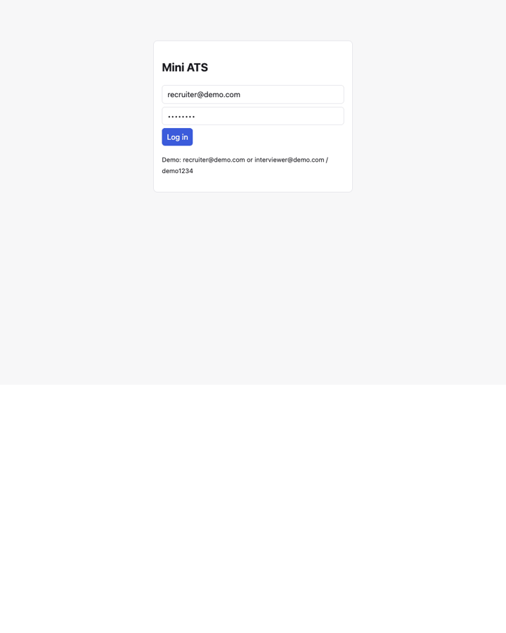

# Mini ATS

A small, public demo of a recruiting loop: **resume → rubric score → candidate card → interview slot (stub) → scorecard**,
with recruiter vs interviewer roles. A public slice inspired by internship work — not proprietary code, and **no real
ATS/calendar/email integrations** (scheduling is stubbed).



## Status
All nine plan slices are implemented. Scheduling is a stub.

| Slice | State |
|---|---|
| Scaffold, jobs + rubric, upload/parse, score run, schedule stub | done |
| Transcript → scorecard (rating, summary, verbatim quotes per criterion) | done |
| RBAC | recruiters see everything; interviewers see only assigned candidates/interviews and can only write scorecards for their own |
| Eval harness | done (below) |

## Architecture
```
React (Vite) ──/api──▶ FastAPI ──▶ SQLAlchemy ──▶ Postgres (SQLite for tests)
                          └─ services/llm.py  ── the only LLM call site (logged); scorer = fake | llm
```
Routers: auth, jobs, candidates (upload + score), schedule, scorecards. Scoring/scorecard services have an offline
`fake` implementation and a Claude implementation sharing one output shape; LLM quotes are verified as verbatim substrings.

## Eval
`cd backend && python -m app.eval.run_eval [--mode fake|llm]` scores 8 synthetic resumes (`app/eval/fixtures`) against
hand-assigned gold scores and prints pass/fail accuracy, precision/recall and per-criterion MAE.
Baseline with the offline scorer: **88% pass/fail accuracy (7/8)**. It was 75% until I added a rule that keyword-only
"skills list" lines are capped at 3/5 — that rule was written *after* seeing the keyword-stuffer fixture, so the gain is
in-sample and likely optimistic. Remaining miss: a borderline data-scientist resume (false fail), a limit of keyword matching. The LLM mode has **not been run yet**
(no API key was available when this was built). Gold labels are subjective and the set is tiny, so treat this as a regression check, not a benchmark.
`pytest` fails if the offline accuracy drops below 87%.

## Run
```bash
cp .env.example .env          # optional: add ANTHROPIC_API_KEY for LLM scoring
docker compose up --build     # web :5173, api :8000
```
Login: `recruiter@demo.com` / `interviewer@demo.com` (password `demo1234`).
No API key → deterministic offline keyword scorer (`SCORER=fake`); with a key → Claude (`SCORER=llm` to force).
LLM evidence quotes are verified to be verbatim resume lines; unverifiable evidence caps the score.

Without Docker: `cd backend && pip install -r requirements.txt && python ../scripts/seed.py && uvicorn app.main:app`, then `cd frontend && npm i && npm run dev`.
Tests: `cd backend && pytest` (SQLite, offline).

## Notes
- Postgres schema comes from Alembic (`alembic upgrade head`, run by Compose); SQLite dev/tests use `create_all`.
- `docker compose up --build` was run end to end (Postgres + Alembic + API + nginx web) via Colima; login → upload → score → schedule → scorecard verified through the web container.
